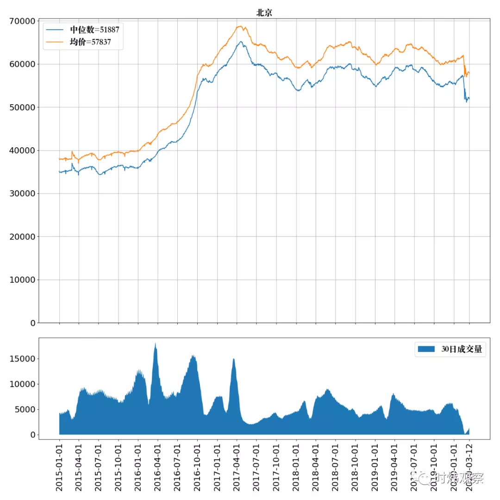

# 赚钱

*   [为什么我要退出币圈 All in 炒鞋 ？](https://www.jinse.com/blockchain/444754.html)                  
而这些炒鞋者的很大一部分其实是初出茅庐的学生。他们究竟是未来的花朵，还是下一波韭菜，引人深思的同时只能交给时间来验证了。                             
*   [求求你们别炒鞋了，币圈都没人接盘了](https://mp.weixin.qq.com/s/dFVMdL46hoLPmvUivFqjWA)           
70后炒房，80后炒股，90后炒币，95后炒鞋，每一代最狂热的人都踩过坑，但是他们竟然都没有一点长进。连给孩子讲讲都不认真。                                  
人类唯一收获的教训就是，人类从来不会收获任何教训。                
*   [万般皆下品，唯有收租高](https://mp.weixin.qq.com/s/vEcF7S0apYKKFmHA6VQvIQ)
*   [B站大V刷单事件：高管被带走调查](https://tech.qq.com/a/20190826/000369.htm)
*   [再坚持一下，你的奶茶店马上破产](https://mp.weixin.qq.com/s?__biz=MzI5MTE2NDI2OQ==&mid=2247485353&idx=1&sn=685b709cfdc9b8e6ba770be3f3cd97df&chksm=ec159eabdb6217bd48b486869df599c0c61d636c4b141ca8ab0afce4385a4d97b38ca97019fe&mpshare=1&scene=23&srcid=0907CYH6rsuwfguMM7MaZLRs&sharer_sharetime=1567857960247&sharer_shareid=19fe229c09c2cd2c6445c2856dcf3d6d#rd)           
问过一个做买卖的大哥，对加盟怎么看？被告知，不怎么看，就是给人送钱。就跟打游戏一样，你加入一个帮派，不管你砸多少钱，多牛逼，最后都是这个帮主赚钱转名声。你最多是比较有面的打手和活跃炮灰。           

*   [贝尔链受害者：不想再看到年轻人家破人亡](https://www.tuoluocaijing.cn/article/detail-64471.html)            
想起之前在社群中看到的一句讨论，「区块链并没有明显改变我们的生活，但是却把传销行业带到了一个新的高度。」         
*   [**感觉女朋友被闺蜜带入旁氏骗局了，如何提醒她 - V2EX**](https://www.v2ex.com/t/543778?p=1)         
背景就不过多介绍了，女朋友的发小闺蜜，在某信托公司，面向 500w 起客户进行信托（感觉是私募股？原谅我这个程序员不懂这些），最近开放了内部员工内购，差不多利润 20-40%，好像分各种类型什么鬼的，半年抽取 20%利润作为佣金，然后她闺蜜把家里 100 多 w 都拿去进行投资，我女朋友看着利润高也想加入，然后就想让我拿钱赞助她一起（我们两个自己管自己的财务），我就只拿了 10w 的年终给她，剩下的钱留着打算近期买房子以及买车（剩下的都是爸妈给的以及平时积攒的工资），然后她就和我吵架说什么别人都是几百万起投，你给我 10w 什么意思多丢人。。。我一直都觉得利润超过 10%的都要小心谨慎，这种 40%的，难道世界上真的有这么高利润的事情？那我还敲个屁代码了都去搞金融去了。。                        
我的直接领导去年年初被一个几乎一模一样的骗局骗走 130 多万。            
对方打着信托的旗号做私募，号称年化 15%（是的，比你女朋友那个看起来靠谱多了），项目发起人是她很熟悉的人，投了不到半年的时间卷钱跑路了。                
我领导本来是打算存完半年就把钱拿出来买房子的。            
PS.我领导中国传媒大学文化科类专业本科毕业，中科院硕士，我们单位是金融类高校，她平常接触金融行业的人最多，深知其中种种猫腻。                     
3.换个思路，如果你真相信这是个发财机会，可以把消息发给马云，他给你 500w 作为介绍费，你让他投 200 亿进去一年赚 80 亿，他肯定投。而你可以无风险挣 500w。            
*   [**《在e租宝上班是怎样的体验》**](https://mp.weixin.qq.com/s/KFjDA3yVIK4WT66OPePPGA)
*   [富人购买资产，你却购买负债](https://mp.weixin.qq.com/s?__biz=MzI4MTkxMDIzOA==&mid=2247484892&idx=1&sn=2b0176b07439d23fc1d61c2b12c7c41f&chksm=eba34b6ddcd4c27bacd8e4a1ea6775ca690a23d5072d5353ef846a84db84ebc6a76d2327617f&mpshare=1&scene=23&srcid=&sharer_sharetime=1573442613987&sharer_shareid=19fe229c09c2cd2c6445c2856dcf3d6d#rd)
*   [股市修仙传V3](https://mp.weixin.qq.com/s?__biz=MzI2MzE2NDczMw==&mid=2649738884&idx=2&sn=a4304c22861195a3f7aa3ea771f8f315&chksm=f25b68d6c52ce1c0def485d860f6e6b558a9b70cb375aa521648ed375eaab180e112b8e06dff&mpshare=1&scene=23&srcid=&sharer_sharetime=1574578698371&sharer_shareid=19fe229c09c2cd2c6445c2856dcf3d6d#rd)
*   [炒鞋大潮里的年轻人](https://www.huxiu.com/article/328286.html)
*   [如何看待拼多多出现 100 元无门槛优惠券的漏洞？可能的技术原因是什么？羊毛党行为是否具有法律风险？](https://daily.zhihu.com/story/9706046)
*   [Google Cloud Platform无限再次申请$300赠金方法](https://51.ruyo.net/9807.html)
*   [套路贷吸血简史](https://mp.weixin.qq.com/s?__biz=MzI2MzE2NDczMw==&mid=2649737294&idx=1&sn=affb7661bd0c91d0e0d7faa66e842280&chksm=f25b6e1cc52ce70aedc232652cf152730f61bc1b214592221a9c468660b7f059d3514fcf9663&mpshare=1&scene=23&srcid=#rd)         
越到后来，所有的高利贷公司都越清楚，自己放出来的钱，本质上不是放给穷人的，而是放给下一家接盘高利贷公司的，他们才是接盘侠       
*   [一个月通话3万分钟！移动亲情号码被滥用隐藏的可怕真相](http://iphone.poppur.com/JiaoCheng/9146.html)
*   [这般在线“养羊”，坐收“羊”利还是理财骗局？](https://mp.weixin.qq.com/s?__biz=Njk5MTE1&mid=2652399751&idx=1&sn=4c2e15a1fcba91b1ecba3b7bc6fb902f&chksm=33d9950304ae1c15f18c9c8cb4cb669ec8ee6ca68ecb5617ed84adc74b245687ef564127c5d9&mpshare=1&scene=23&srcid=#rd)
*   [“银行理财”也会爆雷？非法吸金14亿，近万人被骗，这谁顶得住啊](https://mp.weixin.qq.com/s?__biz=MzU4ODAwNzUwMQ==&mid=2247485748&idx=1&sn=030e9c12d536e6bbb7aae0e1ebe0fa56&chksm=fde21816ca959100dcde8617f489ceb27977430805c97a5a6886482a73c0e06acf56b1e3c867&mpshare=1&scene=23&srcid=#rd)
*   [PTFX骗局：搏命赌徒的末日狂响](https://mp.weixin.qq.com/s?__biz=MzI2MzE2NDczMw==&mid=2649738129&idx=1&sn=9deb508b4c1410d91061662b01d22a52&chksm=f25b6dc3c52ce4d5ba0c9d7f267a83587de257d4a307cde6418ee362eb26cd9dc413fd53a4f5&mpshare=1&scene=23&srcid=&sharer_sharetime=1564577346658&sharer_shareid=19fe229c09c2cd2c6445c2856dcf3d6d#rd)
*   [**调查 | 拼多多刷单-PingWest 品玩**](https://www.pingwest.com/a/187159?utm_source=tuicool&utm_medium=referral)
*   [超利贷市场八面埋伏，海外逃亡只能成为新韭菜？](https://www.iyiou.com/p/112077.html)                 
没有了人脸识别，意味着无法识别非本人贷款，信贷风控的第一道防线就彻底垮了。           
这场行业震动最终蔓延到了超利贷市场的交易底线上：超利贷行业知名的中间担保平台。          
他们不为借款人担保，而是在这个互不信任又无法光明正大通过法律维持交易规则的灰色世界里，以收取押金的形式，为地下超利贷市场甲乙双方担保。                 
*   [“正规”操作掩人耳目 “套路贷”手法复杂升级](http://www.banyuetan.org/xszg/detail/20191115/1000200033137251573781795422160747_1.html)
*   [亿万富翁自首入狱，64套房产被查！中国千亿“吸血”平台，为何难逃一死？](https://mp.weixin.qq.com/s?__biz=MzUzNDY0NzQwMQ==&mid=2247522811&idx=1&sn=262264ac524c6aa4650dc86265ca2008&utm_source=tuicool&utm_medium=referral)
*   [你们别笑，我从下午焦虑到现在](https://mp.weixin.qq.com/s?__biz=MjM5MjAxNTE4MA==&mid=2652147929&idx=1&sn=6ec8eef47ecc4ea4a09b0079135465a0&chksm=bd4c86fa8a3b0fec99af3a328aa0df2cd9c394ce48ed9c156c0479beaf8019c8c48685bed089&mpshare=1&scene=23&srcid=&sharer_sharetime=1575685103346&sharer_shareid=19fe229c09c2cd2c6445c2856dcf3d6d#rd)                             
今天周小川行长的一句话，让我下午坐椅子上想了半天。                
他说中国可以避免快速进入到负利率时代，这话的本意自然是给现下中国趋缓的经济增速打气，但我倒是听出了里面的另一层意思。                   
避免快速进入，那也就是说最后进入是迟早的事，我们只是努力在延缓这个过程。             
其实中国现在的利率已经在历史低位，定存一年是1.5%，我没去查表，印象中这大概是我懂事以来的最低。和股市跌多了一定会反弹不同，利率这东西...以后可能间中会有小弹，但大的趋势肯定还是逐渐向下，直至零，甚至负利率。                  
因为中国经济的体量逐渐变大，发展空间缩小，货币的机会成本下降这几乎是不可逆的。                  
*   [信了大神，老王开始定投理财，结果血本无归，为什么？](https://mp.weixin.qq.com/s?__biz=MzI5OTM3MjMyNA==&mid=2247487870&idx=1&sn=cee1834b872001dd3dcc0b52ced14e60&chksm=ec96cb35dbe1422317a3b00f32813d7de0b262564225542d9ae8f144a343ea9aa4fd109a6142&mpshare=1&scene=23&srcid=&sharer_sharetime=1575869327493&sharer_shareid=19fe229c09c2cd2c6445c2856dcf3d6d#rd)                       
但是其实定投理财照样可以亏的血本无归。标题上我是这样写的：“信了大神，老王开始定投理财，结果血本无归，为什么？” 其中一个答案是老王生在巴西，或者俄罗斯。                       
实际上股市的数据几十年都在。简单做一点学习就可以知道。这个结论过去几十年里对美国股市是成立的，对中国股市也基本上可以成立。只不过中国股市波动性更大。但是如果你不幸出生在巴西，然后套用这套理论买巴西股指，那现在基本上已经血本无归了。                    
我在我的免费星球里发起讨论。只有很少数的人能回答正确。答案其实是在赌国运。一个国家的经济长期看是向上的，股指就长期看向上，所以定投就可以获得这个增长。但是一个国家的经济长期看下降的话，怎么定投都是亏钱的。过去美股是向上的，未来呢？真的未来100年还是同样的趋势么？                           
*   [**北京房价下跌18.5%，首付跌没了**](https://mp.weixin.qq.com/s/WjYOc9pSF-WGcWBwHCYC5w)          
这有零有整的数字当然不是我编的，是最近中国社科院财经战略研究院发布《中国住房市场发展月度分析报告》里说的。         
一线城市房价整体趋于寒冷，除了深圳例外逆势上涨，北京、上海、广州的房价都在持续调整，其中北京的调整最为明显，2019年11月份的房价相较2017年4月，平均下跌了18.5%，如果你是2年半前买的房子，首付已经亏没了。                
*   [职场及人生也需要风险控制](https://mp.weixin.qq.com/s?__biz=MzI0MjA1Mjg2Ng==&mid=2649869077&idx=1&sn=ffef8b71f22f4e0f80e7c0a29b0b4b7c&chksm=f1075178c670d86e865b377f348dc42e527799f545bc4dd3f4264e5ca9e8f6aa5eabd6d4abe7&mpshare=1&scene=23&srcid=&sharer_sharetime=1575261953397&sharer_shareid=19fe229c09c2cd2c6445c2856dcf3d6d#rd)            
中国有这么一批人，乃至企业，传销火的时候他们组群拉人头，各种山寨交易所火的时候他们到处拉韭菜去买期货贵金属，微商火的时候他们给各种垃圾产品拉三级分销，p2p火的时候他们各种拉人去理财投资，小额贷火的时候他们各种哄骗别人去借款，当然，区块链火了他们开始圈人炒币。             
然而，每次出事的时候，他们都故作可怜的站在受害人那一边，屡试不爽。         
帮凶阶级，说来没什么坏事是他们挑头做的，割韭菜的好处一分不少拿，风险责任全推一边。帮凶不担责，这种事情，还会循环往复，循环往复，循环往复。我们抓了一波又一波的骗子，帮凶们一次又一次的置身度外，数钱，分赃，若无其事，好像一切罪责真的与他们毫无关系。             
*   [重大案件破获：团伙操纵8股票获利数亿 26名主犯归案_新浪财经_新浪网](https://finance.sina.com.cn/stock/t/2020-01-03/doc-iihnzhha0180712.shtml?cref=cj)             
在这起案件中，主犯罗山东负责股票账户的操作，指挥集中买入、卖出；龚世威主要负责提供配资，同时也参与操纵交易；贺志华则担当了股市“黑嘴”的角色，负责推荐股票，吸引散户买入。自2017年5月开始，该团伙利用400多个股票账户恶意操纵8只股票，获利达数亿元。        
*   [电影投资的背后，是韭菜的撒币梦](https://mp.weixin.qq.com/s?__biz=MzI5MTE2NDI2OQ==&mid=2247486206&idx=1&sn=229fbb506fb6538e88f54361d29282bb&chksm=ec1593fcdb621aeaa065daf351ecfaad9cbc5a5c1883783ca4992c455088f1c07202c4a9be49&mpshare=1&scene=23&srcid=0119LziDnOuqG3djF1T84Url&sharer_sharetime=1579426791465&sharer_shareid=19fe229c09c2cd2c6445c2856dcf3d6d#rd)  

*   [韭菜简史：快招加盟的致富骗局](https://mp.weixin.qq.com/s?__biz=MzI2MzE2NDczMw==&mid=2649738554&idx=1&sn=cc95b6dd48e53de8edaddcb52a656ee7&utm_source=tuicool&utm_medium=referral)
*   [**我的十年创业路**](https://mp.weixin.qq.com/s?__biz=MzI4NDY5Mjc1Mg==&mid=2247487116&idx=1&sn=6eece1cddf5777aea41589cdba8f9303&chksm=ebf6d6f3dc815fe5ce87844940b33bc09cf84853e279a7f62a0d4f07933bc76212b501dd7f61&mpshare=1&scene=23&srcid=#rd)
*   [知识付费暴打投资机构](https://mp.weixin.qq.com/s?__biz=MzI5MTE2NDI2OQ==&mid=2247488671&idx=1&sn=cd43c02416bbc318ae0ba3e457535040&chksm=ec158d9ddb62048b786bdf1274f695642c6503ae254d2c0e0f9b3e1481ab45a7c85255bb9721&mpshare=1&scene=23&srcid=02239x8uz4NU6gMLdDqIlBIt&sharer_sharetime=1582423169817&sharer_shareid=19fe229c09c2cd2c6445c2856dcf3d6d#rd)
*   [近二十年房贷利率一览表](https://mp.weixin.qq.com/s/nXNI5TuZOPose2Kc3HZT9w)          
      
*   [特朗普是怎么把美股推上绝路的](https://mp.weixin.qq.com/s/uYxhhDTchQzq2e3qsnrDkw)
*   [不对称责任下的疯狂套利](https://mp.weixin.qq.com/s/Qk693uJd2xbnInaOTzzGVQ)      
前面的知乎问答里的论点：所有的股灾的根本原因是估值过高，而不是其他。有人说新冠病毒是原因，我认为只是诱因，新冠病毒前的股市估值已经很离谱了，突发的黑天鹅事件是刺穿泡沫的一个导火索。当然，这个事情本身的体量也是大得惊人。本来盈利水平已经对不起这个估值了，更何况全世界的经济活动要停摆半年，会让本来已经过高的估值的基准——上市公司盈利水平，更加雪上加霜。从而使得股灾，更加火上浇油。         
银行大大提高了周转率，而且资产已经出表了，基本就是跟我没关系了。如果是这样，还有什么好说的，拼命扩大业务规模就是了。一个个10万美元进来就行了，反正早晚一出表就结了。所以需要的不是资产的质量，而是“原料的数量”。所以，就算没稳定工作的底层人士，只要申请房贷，也会获批，不管了，反正量越大越好。               
这个就形成了一种“不对称责任”，利润是银行的，而风险不是他们承担的。这个破坏了金融行业的基本原则：风险对等原则，如果银行乱放贷，是自掘坟墓。但是这种出表甩锅的结构，一切都不一样了。累积了天量的信贷喷涌而出，造成了房地产市场的泡沫。                
天下没有不破的泡沫，再大的泡沫，再绑架国计民生的泡沫，也会破灭，早晚而已。                
大量根本无力负担房贷的人在房价永远涨的迷信下，充当了炮灰，最后资产清零还倒欠一屁股债，最后美联储买下了这些房贷，让所有持有货币的人，一起做了接盘侠。                
这个游戏有没有结束呢？没有，所有的玩法继续，国内看到了这种事情后，已经后来居上，各类ABS的原理大致上是照抄的。学歪门邪道，是非常快的。之前知乎上一度热议的二道贩子房租生意，就是这样转移风险，拼命放大杠杆造成的。            
我能吃到崩盘前的利润，而不用我承担风险，我只关心如何把杠杆放到天上去。          
这个是次贷危机的恶果告诉我们的真理：让风险和责任不对称，人只会作恶到底。           
故事继续，美联储把利率一下降低到0，看到金融机构高管赚翻，游戏玩法曝光后。其他非金融机构的高官颇有醍醐灌顶的感觉。做个毛线实业啊，利用不对称风险，把杠杆怼上天，才是发财正道。               
当有本事低息发债的公司回购自己公司股票，远胜业务增加的年代降临。”被动投资“的大旗就变得更加鼓舞人心。                 
”被动投资“源于市场有效性假说。这个假说认为市场会消化一切潜在的信息，所有择时和选股都是没有任何意义的。这个理论的具体实践应用就是指数ETF基金。      
好了，能发AA债的大公司，在指数里，疯狂回购，战胜其他公司，指数投资又赢。             
指数投资又赢，更多资金追捧指数基金，指数基金里的公司股价又涨更快，被动投资又赢。         
这个循环不断加强，不断加强。终于，到了某一天，被动投资已经超过了主动投资的资金量。            
这是荒诞的，市场的价格发现功能被彻底破坏了，如果大家都做被动投资。         
而被动投资的逻辑和根基是市场价格发现机制。          
到这一步，悖论下的荒诞市场，只是一个自我加强的正反馈，唯一占据主导的是反身性，而无视任何基本面状况。         
所以赚大钱的是那些人：平时赚了钱，黑天鹅的时候不负责的人。当房地产市场泡沫造成的次贷危机毁灭了几乎所有业务的时候，当初的银行高管，是不回吐高奖金的。奥巴马政府的援助款一到，第一件事情是发高额奖金。当美股泡沫完蛋的时候，拿公司名义回购股票，而让员工激励期权赚翻的高管，是不会回吐利润的。           
所以，这些人干的事情，都是利用”不对称风险“获利，并不是自身有特殊的本领。        
而美联储这样的”公器“，无非是利用不对称风险-责任体制漏洞获利者，榨干剥削普通人的工具。
*   [错了就加倍再来！总得回来吧！一次就回本赚钱！——永远有人信的赌徒谬误](https://mp.weixin.qq.com/s/vgOqn0OpHIqdxW_hKFCBSA)
*   [**大白话说期权——除了买涨买跌，我们还能怎么交易？二元期权又是什么鬼？ - 知乎**](https://zhuanlan.zhihu.com/p/19962890)
*   [找一种独特技术指标的组合形成自己的交易系统，那也是我曾经的梦想 - 知乎](https://zhuanlan.zhihu.com/p/19971182)
*   [图穷匕见 - 知乎](https://zhuanlan.zhihu.com/p/20058411)         
世界上有两种股市，股市和中国股市。中国股市的本质，一言以蔽之——国企的融资工具。然后呢？没有然后了，结束了。           
*   [投机与投资的简单算术 - 知乎](https://zhuanlan.zhihu.com/p/20068807)           
追求高收益率，会是个危险的东西，想要坐拥财富，稳健的复利增长才是真正的正途，但这不够爽啊，大家不喜欢。         
大家还是做这个“今年40%，明年可能亏损的”，所谓“承担风险”的明智之选。还有些文章断言，穷人所以是穷人，富人会富，是因为富人敢于承担风险，只能呵呵呵。        
复利，就有这样的力量。巴菲特的年化收益有时候跑不赢标普500，但他能稳定在25%，上述那个“要求不高”的回报率上。     
股民们买股票的目的其实很直白，我们的股民不叫买股，叫炒股。也就说说我们买入股票的时候，并非看好这家上市公司未来的盈利能力，而是预期会有人以更高的价格买走手上的股票。所以，市盈率拉倒吧，这支股票什么题材？                 
*   [天上不会掉馅饼 - 知乎](https://zhuanlan.zhihu.com/wontfallinyourlap)
*   [北京房价更新20200328——市场回暖，跌了，西城海淀朝阳都跌了](https://mp.weixin.qq.com/s/VPA4NR9yxAphawN0yFJvMg)       
      
*   [B站“亿元实盘”大佬被锤哭了](https://mp.weixin.qq.com/s/UgYivFFIF-vPtNB507wDiA)
*   
*   
*   
*   
*   
*   
*   
*   
*   
*   
*   

# 风控

*   [一手捐钱，一手圈钱，大病众筹愁更愁](https://mp.weixin.qq.com/s?__biz=MzI5MTE2NDI2OQ==&mid=2247487208&idx=1&sn=f7f989c352e4107d8534b9164d20bc4a&chksm=ec1597eadb621efcd54577c54513a35f8273307df942e90f3358102e9c98890ef93ae4f34270&mpshare=1&scene=23&srcid=&sharer_sharetime=1575271997955&sharer_shareid=19fe229c09c2cd2c6445c2856dcf3d6d#rd)
*   [羊毛党跑去京东摸了年终奖](https://mp.weixin.qq.com/s?__biz=MzI2MzE2NDczMw==&mid=2649739330&idx=1&sn=cd9c9269fd7387a3e424dcbf9e7bda8f&chksm=f25b7610c52cff062987135098acedfd071f7ecab3cf1f8bcd05f7cbd76b4e5e10beace3e4c8&mpshare=1&scene=23&srcid=011621sKRLHEfFRIhQwUzgd1&sharer_sharetime=1579425765023&sharer_shareid=19fe229c09c2cd2c6445c2856dcf3d6d#rd)
*   [瑞幸是如何暴打资本主义的](https://mp.weixin.qq.com/s/_6yvNti7mb7h0Kicyxuoug)
*   [互联网公司抓内鬼指南V1](https://mp.weixin.qq.com/s?__biz=MzI2MzE2NDczMw==&mid=2649739655&idx=1&sn=9294687b6b55b646343d29d7c8ce2b7e&chksm=f25b77d5c52cfec3508a5108ff329cc99389cf1a6d938592b019e8b2627f90c4d4d4d1adf1e4&mpshare=1&scene=23&srcid=0225aAh3Yi2r0nhK7qHqVqLE&sharer_sharetime=1582623208656&sharer_shareid=19fe229c09c2cd2c6445c2856dcf3d6d#rd)
*   [风控划水，34亿资金翻船，京东诺亚谁在说谎](https://mp.weixin.qq.com/s?__biz=MzI5MTE2NDI2OQ==&mid=2247484195&idx=1&sn=dbf54d461c88f3ff8cab8b46e6c4b3b8&chksm=ec159a21db621337cd73b29de14ca107134dbe71f0a6325489fcee0bfb23f4902a6fa2682178&mpshare=1&scene=23&srcid=0711xp0Zp0FXjHUuaZQuBHTh#rd)
*   [咳血的独角兽3：财务自由诱惑下的道德塌方](https://mp.weixin.qq.com/s?__biz=MzI2MzE2NDczMw==&mid=2649737965&idx=1&sn=71d9db701440a77d32a3cef82bebe2a9&chksm=f25b6cbfc52ce5a9ba8dd621d77a5cc66aaff9d3a03a8eb75dde154652e2f85a3be4a87a9308&mpshare=1&scene=23&srcid=0720vuDgdBb7p6zvWOyNNDzs#rd)
*   [消失了的蚂蚁金服员工1300万受贿判决书](https://tech.sina.com.cn/i/2019-07-18/doc-ihytcerm4537521.shtml)
*   [咳血的独角兽4|血腥丛林中的无底线战争](https://mp.weixin.qq.com/s?__biz=MzI2MzE2NDczMw==&mid=2649738083&idx=1&sn=05697ef3dfe35c30446e7009ef47d6dd&chksm=f25b6d31c52ce4277d560934aba3a5ea0036f4ec6edeca61a11bdabe296e4f664ddf6736d144&mpshare=1&scene=23&srcid=#rd)
*   [咳血的独角兽2 | 互联网幕后攻防](https://mp.weixin.qq.com/s?__biz=MzI5MTE2NDI2OQ==&mid=2247483668&idx=2&sn=c0744c5e8b700eede7f0e5a13b7048b9&chksm=ec159816db621100542d7c1e15998bdad59444823345f4bb82066012631a77bd6e4e7b32a877&scene=21#wechat_redirect)
*   [硬货-如何用风控拯救下架的小红书](https://mp.weixin.qq.com/s?__biz=MzI2MzE2NDczMw==&mid=2649738162&idx=1&sn=7337af200665862fd6592b263e1dad16&chksm=f25b6de0c52ce4f67e026c8066379c5fec6a9899811471ccef6bb74ccf4e22ac5d3c2f702b0e&mpshare=1&scene=23&srcid=&sharer_sharetime=1564573654411&sharer_shareid=19fe229c09c2cd2c6445c2856dcf3d6d#rd)
*   [**咳血的独角兽丨互联网的幕后攻防**](https://mp.weixin.qq.com/s?__biz=MzI2MzE2NDczMw==&mid=2649736978&idx=1&sn=f3412ce5f5eb10ad4993b7a2edc6b281&chksm=f25b6140c52ce856f76ca74bc5142eeab7caf075650e19bae22f44b69221ba16ca897c8cc19c&mpshare=1&scene=23&srcid=#rd)
*   [互联网黑产：那些职业羊毛党到底如何月赚几十万？](https://www.huxiu.com/article/298049.html?utm_source=tuicool&utm_medium=referral)
*   [嗜血的羊毛党，“羊毛头”带你了解羊毛党](http://www.woshipm.com/it/2312234.html?utm_source=tuicool&utm_medium=referral)
*   
*   
*   
*   
*   
